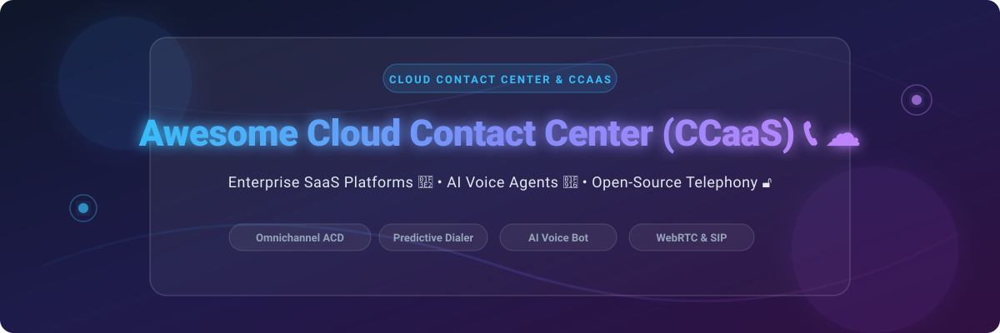

# Awesome-Cloud-Contact-Center-As-A-Service-CCaaS

# Awesome-Cloud-Contact-Center-As-A-Service-CCaaS 📞 ☁️



  





  
  
  
  
  
  



---

## 🌟 Top Cloud Contact Center as a Service (CCaaS) Ecosystem

**Curated List of Commercial CCaaS Platforms & Open-Source Contact Center Solutions**  
*Focused on Omnichannel Routing, Predictive Dialing, AI Voice Agents, Agent Desktop & Self-Hosted Telephony*

**Last updated: October 2026** 📅

---

### 📌 Overview & SEO Summary
Welcome to the ultimate curated directory of **cloud contact center platforms**, **open-source contact center solutions**, and **AI-native telephony frameworks**. Whether you are looking for enterprise-grade commercial solutions (such as *Genesys Cloud CX*, *NICE CXone*, and *Talkdesk*), or self-hostable open-source alternatives (like *VICIdial*, *OMniLeads*, and *ai-native-callcenter*), this list covers category leaders, predictive dialers, and privacy-respecting contact center infrastructure.

---

## 📑 Table of Contents
- [🏢 SaaS & Commercial Platforms](#-saas--commercial-platforms)
- [🔓 Open-Source GitHub Projects](#-open-source-github-projects)
- [🛠️ How to Contribute](#%EF%B8%8F-how-to-contribute)
- [📊 Star History](#-star-history)
- [🤝 Support & Sponsorship](#-support--sponsorship)
- [⚠️ Disclaimer](#%EF%B8%8F-disclaimer)

---

## 🏢 SaaS / Commercial Platforms

The cloud contact center market is dominated by **per-seat per-month pricing** that scales linearly with agent count, making costs predictable for small teams but punishing at scale. A 500-agent Genesys deployment costs **$85,000–$115,000 per month**, while an equivalent VICIdial cluster runs **$18,000–$35,000** — a nearly **$1 million annual difference** . **Amazon Connect** pioneered **pay-per-use pricing** with no per-seat fees, charging only for usage (telephony, messaging, and AI). **Genesys Cloud CX** leads in **omnichannel routing** with skills-based and AI-powered predictive routing . **VICIdial** remains the dominant open-source alternative, with **over 14,000 installations worldwide** and battle-tested **predictive dialing** across hundreds of thousands of outbound campaigns .

| SaaS / Commercial Platform | Company / Owner | Valuation / Market Cap | Standard Edition Starting Price | Free Tier / Free Trial Limits | Description |
| :--- | :--- | :--- | :--- | :--- | :--- |
| **[Amazon Connect](https://aws.amazon.com/connect/)** ☁️ | Amazon | ~$2.0 Trillion | **Pay-per-use** (no per-seat fees); telephony + messaging + AI usage | **Free tier: 90-day trial with $100 credits** | **AWS-native CCaaS** — **No per-seat fees** — pay only for usage. Omnichannel (voice, chat, email, SMS, WhatsApp). AI-powered (Contact Lens, Q in Connect). Integrates with Lambda, DynamoDB, and Lex. |
| **[Genesys Cloud CX](https://www.genesys.com/)** 🧬 | Genesys | Private | **~$75–$155/agent/month** (CX 1–3 tiers)  | **Free trial available** | **Omnichannel leader** — **Best-in-class omnichannel routing** with skills-based, bullseye, and AI-powered predictive routing . Agent Copilot for real-time assistance. **Wins on inbound/omnichannel; VICIdial wins on outbound** . |
| **[NICE CXone](https://www.nice.com/)** 🔵 | NICE Ltd. | ~$10 Billion | Custom enterprise pricing | **Demo available** | **Enterprise CCaaS** — AI-driven workforce engagement, quality management, and analytics. **Enlighten AI** for agent coaching and automation. |
| **[Talkdesk](https://www.talkdesk.com/)** 🟠 | Talkdesk | Private | Custom per-seat pricing | **Free trial available** | **AI-powered CCaaS** — Industry-specific solutions (banking, healthcare, retail). **Talkdesk Autopilot** for self-service automation. |
| **[Five9](https://www.five9.com/)** 🟢 | Five9 Inc. | ~$4 Billion | Custom per-seat pricing | **Free trial available** | **Intelligent cloud contact center** — AI-powered routing, agent assist, and analytics. **IVR and predictive dialing** options. |
| **[Twilio Flex](https://www.twilio.com/flex)** 🟣 | Twilio | ~$30 Billion | **$1.00/active user hour** (pay-as-you-go)  | **Free trial: $15 credit** | **Programmable CCaaS** — **Fully customizable** agent desktop. Build any workflow with Twilio APIs. **No per-seat fees** — pay per active hour. |
| **[Cisco Webex Contact Center](https://www.webex.com/contact-center.html)** 🔴 | Cisco | ~$200 Billion | Custom per-seat pricing | **Free trial available** | **Enterprise CCaaS** — Omnichannel routing, AI-powered agent assistance, and Webex ecosystem integration. |
| **[8x8 Contact Center](https://www.8x8.com/)** 📞 | 8x8 Inc. | ~$1 Billion | Custom per-seat pricing | **Free trial available** | **Unified communications CCaaS** — Integrated with 8x8 UCaaS for a single platform. Omnichannel routing and analytics. |
| **[Dialpad Ai Contact Center](https://www.dialpad.com/)** 🎯 | Dialpad | Private | Custom per-seat pricing | **Free trial available** | **AI-native CCaaS** — Built-in **Dialpad Ai** for real-time transcription, sentiment analysis, and agent coaching. |
| **[Vonage Contact Center](https://www.vonage.com/)** 📡 | Vonage (Ericsson) | ~$30 Billion (Ericsson) | Custom per-seat pricing | **Free trial available** | **CCaaS with CPaaS integration** — Vonage APIs for custom communication workflows. Salesforce-native integration. |

---

## 🔓 Open-Source GitHub Projects

*Sorted by GitHub_Stars_Count (Descending)* 🌟

- **[ai-native-callcenter](https://github.com/rasonyang/ai-native-callcenter)**   
  **Self-hosted, API-first AI call center**, Apache-2.0 licensed. **The AI is the default answer, not an add-on** . **One Go binary** — REST API, SSE event stream, and web interface all inside it, plus PostgreSQL and FreeSWITCH. **Speech-to-speech voice model** answers every call; a flow steers the conversation and decides when a human is needed. **Transfers into `mod_callcenter` queues** where agents work in the browser via a Chrome extension . **One call record per conversation** — bot phase and human phase end as **one CDR, one transcript, one recording** . **Provider-agnostic**: OpenAI, Qwen, Doubao, Gemini, or your own OpenAI-Realtime-compatible gateway. **Docker Compose deployment** seeds a demo dataset with 18 simulated phones and a week of history . **The most modern open-source AI-native call center available**. 🤖

- **[VICIdial](https://github.com/ricklabe/VICIdial)**   
  **The dominant open-source contact center platform**, AGPL-2.0 licensed. **Over 14,000 installations worldwide** . **Battle-tested predictive dialer** — true predictive, progressive, ratio, power, and manual dialing modes. **Adaptive algorithm** adjusts dial levels based on real-time agent availability and answer rates . **Inbound ACD, blended campaigns, call recording, real-time monitoring, agent scripting, and non-agent API**. Active development on SVN trunk (revision 3939+, v2.14b0.5 as of early 2026) . **The only open-source platform purpose-built for high-volume outbound contact center operations** . **At 500 agents, VICIdial saves ~$800K–$960K/year vs Genesys** . 🏆

- **[OMniLeads](https://github.com/alejandrozf/ominicontacto)**   
  **100% open-source contact center software**, GPL-3.0 licensed. **Based on WebRTC technology** . **Inbound, preview, and manual outbound campaigns** natively; **predictive/progressive dialer** via integration APIs . **Video call campaigns** from web pages since v1.25.0. **Agent & Supervisor console based on WebRTC**. **Multiple user profiles**: administrator, supervisor admin, supervisor client, agent. **Answering machine detection, full recording, productivity reports, real-time supervision, Web forms, CRM/ERP integration APIs, remote agents, and clusterization** . **Components**: Asterisk, Kamailio, RtpEngine, Django, Nginx, Postgres, Python, VueJS, Docker, Podman. **The most feature-complete open-source inbound/blended contact center**. 🏛️

- **[Wazo Platform](https://github.com/wazo-platform/wazo-docker)**   
  **Full-featured IPBX solution built atop Asterisk**, GPL-3.0 licensed. **Modern APIs and microservices architecture** . **Contact center module** handles **inbound queues and basic agent management** — architecturally more modern than FreePBX or Issabel, but **call center functionality still limited to inbound queue distribution** . **No predictive dialing, no outbound campaign management**. **Best for**: organizations wanting a modern, API-first PBX foundation with basic contact center capabilities that can be extended. 🎯

- **[Tring](https://pypi.org/project/tring/)**   
  **Open-source voice agent stack**, MIT licensed. **One agent contract, any runtime, honest costs** . **Three runtimes**: cascaded pipeline (STT → LLM → TTS), speech-to-speech model, or hybrid — **swap with a config change, no code rewrite** . **Local-first**: faster-whisper for STT, Ollama for LLM, Kokoro for TTS — **$0 per minute, zero cloud dependencies** . **Latency as correctness**: tool-call choreography, speak-while-thinking, interruption reconciliation, cache-safe language lock . **Honest cost accounting**: per-call, per-connected-minute, per-conversation, and per-outcome roll-ups . **Per-language provider routing** for callers who code-switch mid-sentence . **Early alpha** — telephony ingress (SIP) and hosted dashboard on roadmap . 🎙️

- **[ZeroVoice](https://pypi.org/project/zerovoice/)**   
  **AI-powered call center in a pip package**, open-source. **Natural conversations, concurrent calling, real-time monitoring** . **Rust core** — 10x faster than pure Python. **100+ simultaneous calls** supported. **Web dashboard** with real-time statistics, call history, transcript viewer, quick dial, and campaign launcher . **Pythonic API** for non-Rust developers. **Twilio integration** for telephony. **Campaign management** with CSV upload and script templates . **The easiest way to start with AI voice calling in Python**. 🐍

- **[cx-cloud-ai](https://pypi.org/project/cx-cloud-ai/)**   
  **Distributed AI orchestration toolkit for customer service**, open-source. **Reusable orchestration primitives** for contact-center workloads across voice, chat, email, and ticketing channels . **Smart routing** by channel, intent, priority, customer tier, and sentiment. **Agent state management** tracking availability, skills, active channels, capacity, and load. **AI summarization** with deterministic local fallback or plug-in provider. **Distributed workload orchestration** for AI and service tasks. **SLA monitoring** with p50, p90, and p99 latency tracking. **Audit logging** with hashed customer IDs and PII redaction . **Not a chatbot framework or helpdesk product** — provides reusable building blocks . 🧩

- **[unpod](https://github.com/unpod-ai/unpod)**   
  **Open-Source CPaaS for Contact Center Teams**, open-source. **Full-stack monorepo**: Next.js 16 frontend, Django 5 backend, FastAPI microservices, MongoDB, Redis, Kafka (KRaft), Centrifugo v5 . **Voice AI**: LiveKit + Pipecat + LangChain. **AI Studio and Agent Studio** for building voice agents. **Multi-tenant organizations with RBAC** and JWT auth. **Knowledge base, document store, and AI search**. **Desktop app via Tauri**. **Not a lightweight tool** — requires PostgreSQL, MongoDB, Redis, and Kafka . 🏗️

- **[Asterisk](https://github.com/asterisk/asterisk)**   
  **The open-source telephony engine that powers most contact center platforms**, GPL-2.0 licensed. **Not call center software** — it is a **PBX framework**, a programmable phone system . **Handles SIP connectivity, call routing, codec transcoding, and VoIP protocol management**. **Does not handle campaigns, lead lists, agent states, or predictive dial ratios** — those require building on top . **The raw material for contact centers** — VICIdial, OMniLeads, and Wazo all run on Asterisk. 🏗️

- **[FreeSWITCH](https://github.com/signalwire/freeswitch)**   
  **Scalable open-source cross-platform telephony platform**, MPL-2.0 licensed . **Alternative to Asterisk** — powers **ai-native-callcenter** and **FusionPBX** . **More scalable than Asterisk** for high-concurrency environments. **The foundation for modern, AI-native contact center projects**. ⚡

---

## 🛠️ How to Contribute

Contributions are welcome! Follow these steps to submit new CCaaS platforms or open-source contact center software:

1. 🍴 **Fork** the repository.
2. 📝 **Add/edit** entries in `README.md` maintaining table/list structure and formatting.
3. 🔗 Include project title, official website/GitHub link, exact Stars_Count, license, and brief description.
4. 🚀 Submit a **Pull Request** with a descriptive summary of your changes.

---

## 📊 Star History



---

## 🤝 Support & Sponsorship

If you find this cloud contact center repository useful, please consider supporting the project:

- ⭐ **Star** this repository to increase visibility!
- 🔀 **Fork** and share with fellow contact center engineers, telephony developers, and open-source advocates.
- ☕ **Sponsor & Buy Me a Coffee**: Support ongoing open-source curation via the [GitHub Sponsor Dashboard](https://github.com/sponsors/ishandutta2007).

---

## ⚠️ Disclaimer

- This is a **community-curated** list — not exhaustive and not an endorsement. ℹ️
- **Open-source contact center software is not free** — VICIdial itself is free, but at 100 agents the real monthly costs are **$5,600–$14,800** including server infrastructure, SIP trunking, DIDs, system administration, STIR/SHAKEN compliance, and monitoring . **The per-agent cost drops dramatically at scale** — at 500 agents, VICIdial runs **$25–$60/agent/month** vs Genesys at flat or increasing rates .
- **VICIdial wins on outbound predictive dialing** — its adaptive algorithm and granular campaign configuration are unmatched . **Genesys wins on inbound/omnichannel** — true unified routing across voice, email, chat, SMS, and social . **AI and automation favors Genesys** — for now .
- **Asterisk is not call center software** — it is a PBX framework. **You can build a call center on Asterisk the same way you can build a house out of lumber: the raw material is there, but you need an enormous amount of engineering** .
- Open-source solutions (VICIdial, OMniLeads, ai-native-callcenter) provide self-hosted ownership and transparency, but enterprise-grade SLA guarantees, managed infrastructure, and 24/7 support remain primarily commercial offerings. **Always model total cost of ownership including administration, not just license fees**, before committing. 📞

---



  <b>Made with ❤️ for contact center engineers, telephony developers, and open-source CCaaS advocates.</b>

